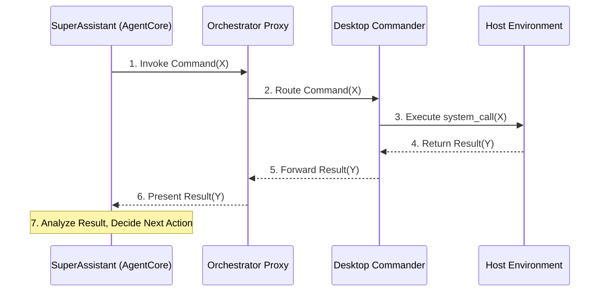

# Orchestration Architecture

This document outlines the core architectural components and the operational flow of the system.

## Core Components

The system is composed of four primary components that work together to create a responsive, event-driven automation platform.

-   **SA (SuperAssistant)**: The intelligent agent that processes high-level user requests, formulates plans, and decides what actions to take. It acts as the "brain" of the operation.
-   **DC (Desktop Commander)**: The execution agent that runs on a target user machine. It has direct access to the local operating system to perform tasks like reading files, executing commands, and managing processes. It acts as the "hands" of the operation.
-   **AgentCore**: The underlying logic and reasoning engine that powers the SuperAssistant, enabling it to plan, learn, and utilize its tools effectively.
-   **Proxy (Orchestrator)**: A central component that acts as a message bus and switchboard between the SA and one or more DCs. It receives instructions from the SA and routes them to the appropriate DC, and conversely, funnels results and events from the DCs back to the SA.

---

### The Orchestration Loop

The architecture is fundamentally designed to support a continuous **feedback loop**, enabling responsive and persistent operations. The **Proxy** is the key enabler of this loop.

The operational flow is as follows:

1.  **Action**: The **SA** determines a task is needed and sends a command to the **Proxy**.
2.  **Routing**: The **Proxy** routes this command to the appropriate **DC** in the target environment.
3.  **Execution**: The **DC** executes the command on the host **OS**.
4.  **Feedback**: The result from the OS is captured by the **DC** and sent back upstream to the **Proxy**.
5.  **Analysis**: The **Proxy** forwards this result back to the **SA**, which then analyzes the outcome and decides on the next action, thus restarting the loop.

---

### Triggering Mechanism

The system supports bidirectional triggers, all arbitrated by the **Proxy**.

-   **Downstream Trigger (Commands)**: The standard flow where the `SA/AgentCore` initiates a request that flows through the `Proxy` to trigger an action in the `DC -> OS`.
-   **Upstream Trigger (Events)**: A more advanced flow where a `DC` monitors the `OS` for specific events (e.g., file changes, new commits). When an event occurs, the `DC` can proactively send a message to the `Proxy`, which in turn triggers the `SA` to process the event. This allows the system to react to changes in its environment autonomously.

This architecture transforms the system from a simple command-executor into a true orchestration platform capable of complex, event-driven automation.